# Bangla Hope SMS - Data Architecture Map

This document visualizes the database structure, organized by logical functional domains. The system uses a **Master-Relational Model** anchored by the `STUDENTS` table.

---

## 1. High-Level Domain Map

| Domain | Primary Tables | Responsibility |
| :--- | :--- | :--- |
| **System & Auth** | `USERS`, `SITES`, `PERMISSIONS` | Global configuration, security, and offline sync metadata. |
| **Student Core** | `STUDENTS`, `PROGRAMS`, `IDENTIFIERS` | The "Single Source of Truth" for child bio-data and history. |
| **Education** | `ACADEMIC_RECORDS`, `ATTENDANCE` | Yearly progress tracking and school-specific metrics. |
| **Sponsorship** | `SPONSORS`, `SPONSORSHIPS`, `COMMS` | Managing relationships and donor communication pipelines. |
| **Financial** | `RECEIPTS`, `ALLOCATIONS`, `LOANS` | Tracking USD-only income vs. grant/loan expenditures. |
| **Data Migration** | `MIGRATION_STAGING`, `METADATA` | High-integrity staging for legacy data import. |

---

## 2. Logical Entity Relationship Diagram

```mermaid
erDiagram
    %% ==========================================
    %% 1. SYSTEM & SECURITY (Top Left)
    %% ==========================================
    SITES {
        uuid id PK
        text name
        text code UK
        boolean is_remote_office
        timestamptz last_sync_at
        int row_version
    }

    USERS {
        uuid id PK
        text username UK
        text role
        uuid site_id FK
        boolean is_active
        int row_version
    }

    PERMISSIONS {
        uuid id PK
        text code UK
        text module
    }

    ROLE_PERMISSIONS {
        text role PK
        uuid permission_id PK, FK
    }

    AUDIT_LOGS {
        uuid id PK
        uuid user_id FK
        text module
        jsonb mutation_detail
    }

    %% ==========================================
    %% 2. STUDENT CORE (Center Anchor)
    %% ==========================================
    STUDENTS {
        uuid id PK
        bigint master_id_number UK
        text legacy_id
        text first_name
        text last_name
        uuid current_program_id FK
        uuid staff_parent_id FK
        timestamptz last_synced_at
        int row_version
    }

    STUDENT_IDENTIFIERS {
        uuid id PK
        uuid student_id FK
        text id_value
        uuid program_id FK
        boolean is_current
    }

    PROGRAMS {
        uuid id PK
        text name
        text code UK
    }

    INSTITUTIONS {
        uuid id PK
        text name
        text type
    }

    DOCUMENTS {
        uuid id PK
        uuid student_id FK
        text name
        text type
        text file_url
    }

    %% ==========================================
    %% 3. EDUCATION & PROGRESS (Center Bottom)
    %% ==========================================
    ACADEMIC_RECORDS {
        uuid id PK
        uuid student_id FK
        uuid institution_id FK
        int year
        numeric attendance_percentage
    }

    ATTENDANCE_RECORDS {
        uuid id PK
        uuid student_id FK
        int year
        int days_present
        int total_school_days
    }

    REPORTS {
        uuid id PK
        uuid student_id FK
        int year
        text status
        uuid approved_by FK
    }

    STUDENT_HISTORY {
        uuid id PK
        uuid student_id FK
        date event_date
        text title
    }

    %% ==========================================
    %% 4. SPONSORSHIP & COMMS (Top Right)
    %% ==========================================
    SPONSORS {
        uuid id PK
        text sponsor_id_code UK
        uuid user_id FK
        text full_name
        text status
    }

    SPONSORSHIPS {
        uuid id PK
        uuid student_id FK
        uuid sponsor_id FK
        text type
        boolean is_active
    }

    COMMUNICATION_TEMPLATES {
        uuid id PK
        text code UK
        text category
    }

    COMMUNICATIONS {
        uuid id PK
        uuid student_id FK
        uuid sponsor_id FK
        uuid template_id FK
        text status
    }

    EMAIL_OUTBOX {
        uuid id PK
        uuid communication_id FK
        text status
        int retry_count
    }

    %% ==========================================
    %% 5. FINANCIAL LEDGER (Bottom Right)
    %% ==========================================
    SPONSORSHIP_RECEIPTS {
        uuid id PK
        uuid sponsorship_id FK
        numeric amount
        int period_month
        int period_year
    }

    FINANCIAL_ALLOCATIONS {
        uuid id PK
        uuid student_id FK
        text type
        numeric amount
        boolean is_active
    }

    ALLOCATION_PAYOUTS {
        uuid id PK
        uuid allocation_id FK
        numeric amount
        text status
    }

    LOANS {
        uuid id PK
        uuid student_id FK
        text status
    }

    LOAN_DISBURSEMENTS {
        uuid id PK
        uuid loan_id FK
        numeric amount
    }

    LOAN_REFUNDS {
        uuid id PK
        uuid loan_id FK
        numeric amount
    }

    %% ==========================================
    %% RELATIONSHIPS
    %% ==========================================
    
    %% Security & Infrastructure
    SITES ||--o{ USERS : "hosts"
    USERS ||--o{ AUDIT_LOGS : "generates"
    PERMISSIONS ||--o{ ROLE_PERMISSIONS : "assigned to"

    %% Core Data Linking
    PROGRAMS ||--o{ STUDENTS : "tracks current"
    PROGRAMS ||--o{ STUDENT_IDENTIFIERS : "categorizes"
    STUDENTS ||--o{ STUDENT_IDENTIFIERS : "possesses"
    STUDENTS ||--o{ DOCUMENTS : "linked to"
    USERS ||--o{ STUDENTS : "parent of (Staff Child)"

    %% Educational Progress
    STUDENTS ||--o{ ACADEMIC_RECORDS : "earns"
    STUDENTS ||--o{ ATTENDANCE_RECORDS : "tracks"
    STUDENTS ||--o{ REPORTS : "generates"
    STUDENTS ||--o{ STUDENT_HISTORY : "undergoes"
    INSTITUTIONS ||--o{ ACADEMIC_RECORDS : "hosts"

    %% Sponsorship Lifecycle
    SPONSORS ||--o{ SPONSORSHIPS : "funds"
    STUDENTS ||--o{ SPONSORSHIPS : "benefits from"
    USERS ||--o| SPONSORS : "links to account"

    %% Communication Flow
    SPONSORS ||--o{ COMMUNICATIONS : "receives"
    STUDENTS ||--o{ COMMUNICATIONS : "subject of"
    COMMUNICATION_TEMPLATES ||--o{ COMMUNICATIONS : "defines"
    COMMUNICATIONS ||--o{ EMAIL_OUTBOX : "triggers"

    %% Financial Ledger
    SPONSORSHIPS ||--o{ SPONSORSHIP_RECEIPTS : "collects"
    STUDENTS ||--o{ FINANCIAL_ALLOCATIONS : "receives"
    FINANCIAL_ALLOCATIONS ||--o{ ALLOCATION_PAYOUTS : "payouts for"
    
    STUDENTS ||--o{ LOANS : "holds"
    LOANS ||--o{ LOAN_DISBURSEMENTS : "pays out"
    LOANS ||--o{ LOAN_REFUNDS : "recovers"

```

---

## 3. Physical Placement & Sync Logic

### A. The "Sync-Aware" Columns
Every record that needs to be synchronized between the **Main Office (Hili)** and **Remote Sites** must include:
*   `row_version`: An integer that increments on every change.
*   `last_synced_at`: A timestamp updated by the sync engine upon successful transmission.
*   `site_id`: To identify the origin of the record.

### B. High-Traffic Partitioning
To maintain performance over "thousands of students" (Proposal 3.6.1), the following tables should be physically partitioned by **Year** or **Month**:
1.  `audit_logs`
2.  `email_outbox`
3.  `attendance_records`

### C. The Staging Layer
The `MIGRATION_STAGING_STUDENTS` table exists outside the standard relational constraints. It allows for the "Automated Validation" required by the proposal without risking the integrity of the `STUDENTS` table. Once a record passes all checks in staging, it is "promoted" to the Core tables and linked via `MIGRATION_METADATA`.

---

## 4. Site Identification & Remote Operations

To maintain a "Zero-Configuration" workflow for non-technical field staff, the system identifies remote locations via **User-to-Site Association**:

### A. Central Registration
1.  Admins at HQ key in each physical office/school into the **Site Registry**.
2.  Each **User Account** is then linked to a specific **Site ID** in the database.

### B. Automatic Tagging
*   When a staff member logs in and performs an action (e.g., adds a student record), the application automatically tags the data with the `site_id` associated with their user profile.
*   The staff member never has to enter site codes or setup tokens.

### C. Security
Security relies on standard **User Authentication** (Username/Password). Advanced device-level authorization is currently deferred (see `OPTIONAL_FEATURES.md`).

---

## 5. Sync Conflict Resolution Strategy (Hybrid Model)

To fulfill the **"Offline Remote Operation"** requirement (Proposal 3.6.1), the system implements a hybrid conflict resolution model:

### A. Field-Level Merging (Automatic)
The sync engine compares updates at the **column level**, not the row level. 
*   **Logic:** If Site A updates `first_name` and Site B updates `contact_number`, the system automatically merges both changes.
*   **Outcome:** Seamless experience for 95% of collisions.

### B. The Conflict Queue (Manual)
If the exact same field is modified (e.g., both sites update `situation_overview`), the server:
1.  **Refuses** the update to the main table.
2.  **Parks** both the current central HQ server state and the incoming remote state into the `SYNC_CONFLICTS` table.
3.  **Alerts** the Admin to perform a "Side-by-Side" visual resolution.

### C. Financial Lockdown
For tables in the **Financial Ledger** domain (`RECEIPTS`, `PAYOUTS`, `LOAN_DISBURSEMENTS`), automatic merging is **DISABLED**. All financial collisions require manual review to ensure strict digital ledger integrity.
