# Bangla Hope SMS - Overall ER Diagram

Below is the comprehensive technical Entity Relationship Diagram (ERD) for the Bangla Hope Sponsorship Management System. This diagram includes all specialized tables for offline sync, data migration, and advanced communication tracking.

```mermaid
erDiagram
    %% ==========================================
    %% REFERENCE & INFRASTRUCTURE
    %% ==========================================
    SITES {
        uuid id PK
        text name
        text code UK
        text location_details
        boolean is_remote_office
        boolean is_active
        timestamptz last_sync_at
        timestamptz created_at
        timestamptz updated_at
        int row_version
    }

    PROGRAMS {
        uuid id PK
        text name
        text code UK
        text description
        timestamptz created_at
        timestamptz updated_at
        int row_version
    }

    INSTITUTIONS {
        uuid id PK
        text name
        text type
        text location
        timestamptz created_at
        timestamptz updated_at
        int row_version
    }

    %% ==========================================
    %% USER & SECURITY
    %% ==========================================
    PERMISSIONS {
        uuid id PK
        text code UK
        text name
        text module
        text description
        timestamptz created_at
        int row_version
    }

    USERS {
        uuid id PK
        text username UK
        text email UK
        text password_hash
        text full_name
        text role
        uuid site_id FK
        text office_location
        boolean is_active
        timestamptz last_login
        timestamptz deleted_at
        timestamptz created_at
        timestamptz updated_at
        int row_version
    }

    ROLE_PERMISSIONS {
        text role PK
        uuid permission_id PK, FK
    }

    AUDIT_LOGS {
        uuid id PK
        uuid user_id FK
        text module
        text action
        uuid target_id
        text target_type
        jsonb mutation_detail
        inet ip_address
        timestamptz created_at
    }

    %% ==========================================
    %% STUDENT CORE
    %% ==========================================
    STUDENTS {
        uuid id PK
        bigint master_id_number UK
        text legacy_id
        text first_name
        text last_name
        text gender
        date dob
        text religion
        date admission_date
        text status
        text father_name
        text mother_name
        text primary_guardian
        uuid staff_parent_id FK
        int siblings_count
        text contact_number
        text situation_overview
        text photo_url
        uuid current_program_id FK
        timestamptz deleted_at
        timestamptz created_at
        timestamptz updated_at
        int row_version
        timestamptz last_synced_at
    }

    STUDENT_IDENTIFIERS {
        uuid id PK
        uuid student_id FK
        text id_value
        uuid program_id FK
        boolean is_current
        timestamptz assigned_at
        timestamptz updated_at
        int row_version
    }

    DOCUMENTS {
        uuid id PK
        uuid student_id FK
        uuid sponsor_id FK
        text name
        text type
        text file_url
        jsonb metadata
        uuid created_by FK
        timestamptz created_at
        timestamptz updated_at
        int row_version
    }
    
    MIGRATION_METADATA {
        uuid id PK
        text table_name
        text source_id
        uuid target_uuid
        text migration_batch
        timestamptz migrated_at
    }

    MIGRATION_STAGING_STUDENTS {
        int id PK
        jsonb raw_data
        text validation_errors
        text status
        timestamptz created_at
    }

    %% ==========================================
    %% SPONSORSHIP SYSTEM
    %% ==========================================
    SPONSORS {
        uuid id PK
        text sponsor_id_code UK
        uuid user_id FK
        text full_name
        text email UK
        text phone
        text address_line1
        text city
        text postal_code
        text country
        text preferred_communication
        text internal_notes
        text status
        timestamptz deleted_at
        timestamptz created_at
        timestamptz updated_at
        int row_version
    }

    SPONSORSHIPS {
        uuid id PK
        uuid student_id FK
        uuid sponsor_id FK
        text type
        date start_date
        date end_date
        boolean is_active
        timestamptz created_at
        timestamptz updated_at
        int row_version
    }

    CONTRIBUTIONS {
        uuid id PK
        uuid sponsor_id FK
        uuid student_id FK
        uuid sponsorship_id FK
        numeric amount
        text currency
        date received_date
        text payment_method
        text reference_number
        int period_month
        int period_year
        text notes
        timestamptz created_at
        timestamptz updated_at
        int row_version
    }

    %% ==========================================
    %% RECORDS & HISTORY
    %% ==========================================
    ACADEMIC_RECORDS {
        uuid id PK
        uuid student_id FK
        uuid institution_id FK
        int year
        text grade_level
        text result_summary
        numeric attendance_percentage
        timestamptz created_at
        timestamptz updated_at
        int row_version
    }

    ATTENDANCE_RECORDS {
        uuid id PK
        uuid student_id FK
        int year
        int days_present
        int total_school_days
        text remarks
        timestamptz created_at
        timestamptz updated_at
        int row_version
    }

    REPORTS {
        uuid id PK
        uuid student_id FK
        int year
        text type
        text status
        uuid approved_by FK
        timestamptz approved_at
        date completion_date
        text pdf_url
        timestamptz created_at
        timestamptz updated_at
        int row_version
    }

    STUDENT_HISTORY {
        uuid id PK
        uuid student_id FK
        date event_date
        text title
        text description
        boolean is_milestone
        timestamptz created_at
        timestamptz updated_at
        int row_version
    }

    FINANCIAL_ALLOCATIONS {
        uuid id PK
        uuid student_id FK
        text type
        numeric amount
        text currency
        text frequency
        date start_date
        date end_date
        boolean is_active
        text notes
        timestamptz created_at
        timestamptz updated_at
        int row_version
    }

    ALLOCATION_PAYOUTS {
        uuid id PK
        uuid allocation_id FK
        numeric amount
        text currency
        date payout_date
        uuid recorded_by FK
        text status
        text notes
        timestamptz created_at
        int row_version
    }

    %% ==========================================
    %% LOAN SYSTEM
    %% ==========================================
    LOANS {
        uuid id PK
        uuid student_id FK
        uuid institution_id FK
        text currency
        text status
        text agreement_url
        timestamptz created_at
        timestamptz updated_at
        int row_version
    }

    LOAN_DISBURSEMENTS {
        uuid id PK
        uuid loan_id FK
        numeric amount
        text currency
        date disbursement_date
        text category
        text notes
        timestamptz created_at
        int row_version
    }

    LOAN_REFUNDS {
        uuid id PK
        uuid loan_id FK
        numeric amount
        text currency
        date refund_date
        uuid recorded_by FK
        text notes
        timestamptz created_at
        int row_version
    }

    %% ==========================================
    %% COMMUNICATIONS
    %% ==========================================
    COMMUNICATION_TEMPLATES {
        uuid id PK
        text code UK
        text name
        text category
        text subject_line
        text body_content
        boolean is_active
        timestamptz deleted_at
        uuid created_by FK
        timestamptz created_at
        timestamptz updated_at
        int row_version
    }

    COMMUNICATIONS {
        uuid id PK
        uuid student_id FK
        uuid sponsor_id FK
        uuid template_id FK
        text category
        text type
        text status
        uuid trigger_id FK
        text trigger_type
        text message_body
        jsonb message_metadata
        text pdf_url
        timestamptz sent_at
        timestamptz created_at
        timestamptz updated_at
        int row_version
    }

    EMAIL_OUTBOX {
        uuid id PK
        uuid communication_id FK
        text recipient_email
        text subject
        text body_html
        text status
        int retry_count
        text last_error
        timestamptz scheduled_at
        timestamptz sent_at
        timestamptz created_at
    }

    SMTP_LOGS {
        uuid id PK
        uuid outbox_id FK
        text response_code
        text response_message
        timestamptz sent_at
    }

    SYSTEM_HEALTH_LOGS {
        uuid id PK
        text event_type
        text status
        text details
        timestamptz created_at
    }

    SYNC_CONFLICTS {
        uuid id PK
        text table_name
        uuid record_id
        uuid conflicting_site_id FK
        jsonb central_server_data
        jsonb remote_data
        text overlap_columns
        text status
        timestamptz created_at
    }

    %% ==========================================
    %% RELATIONSHIPS
    %% ==========================================
    SITES ||--o{ USERS : "hosts"
    USERS ||--o{ AUDIT_LOGS : "generates"
    USERS ||--o{ LOAN_REFUNDS : "records"
    USERS ||--o{ COMMUNICATION_TEMPLATES : "manages"
    USERS ||--o{ DOCUMENTS : "uploads"
    USERS ||--o{ ALLOCATION_PAYOUTS : "records"
    USERS ||--o{ STUDENTS : "parent of (Staff Child)"

    PERMISSIONS ||--o{ ROLE_PERMISSIONS : "assigned to"
    
    PROGRAMS ||--o{ STUDENTS : "tracks current"
    PROGRAMS ||--o{ STUDENT_IDENTIFIERS : "categorizes"
    
    STUDENTS ||--o{ STUDENT_IDENTIFIERS : "possesses"
    STUDENTS ||--o{ ACADEMIC_RECORDS : "earns"
    STUDENTS ||--o{ ATTENDANCE_RECORDS : "tracks"
    STUDENTS ||--o{ REPORTS : "generates"
    STUDENTS ||--o{ STUDENT_HISTORY : "undergoes"
    STUDENTS ||--o{ FINANCIAL_ALLOCATIONS : "receives"
    STUDENTS ||--o{ SPONSORSHIPS : "benefits from"
    STUDENTS ||--o{ LOANS : "holds"
    STUDENTS ||--o{ COMMUNICATIONS : "subject of"
    STUDENTS ||--o{ DOCUMENTS : "linked to"

    INSTITUTIONS ||--o{ ACADEMIC_RECORDS : "hosts"
    INSTITUTIONS ||--o{ LOANS : "receives funds at"

    SPONSORS ||--o{ SPONSORSHIPS : "funds"
    SPONSORS ||--o{ COMMUNICATIONS : "receives"
    SPONSORS ||--o{ DOCUMENTS : "linked to"

    SPONSORS ||--o{ CONTRIBUTIONS : "makes"
    STUDENTS ||--o{ CONTRIBUTIONS : "receives"
    SPONSORSHIPS ||--o{ CONTRIBUTIONS : "fulfills (optional)"
    CONTRIBUTIONS ||--o| COMMUNICATIONS : "triggers"
    REPORTS ||--o| COMMUNICATIONS : "linked to"
    COMMUNICATION_TEMPLATES ||--o{ COMMUNICATIONS : "defines"

    FINANCIAL_ALLOCATIONS ||--o{ ALLOCATION_PAYOUTS : "payouts for"

    COMMUNICATIONS ||--o{ EMAIL_OUTBOX : "triggers"
    EMAIL_OUTBOX ||--o{ SMTP_LOGS : "generates"

    LOANS ||--o{ LOAN_DISBURSEMENTS : "pays out"
    LOANS ||--o{ LOAN_REFUNDS : "recovers"
```

