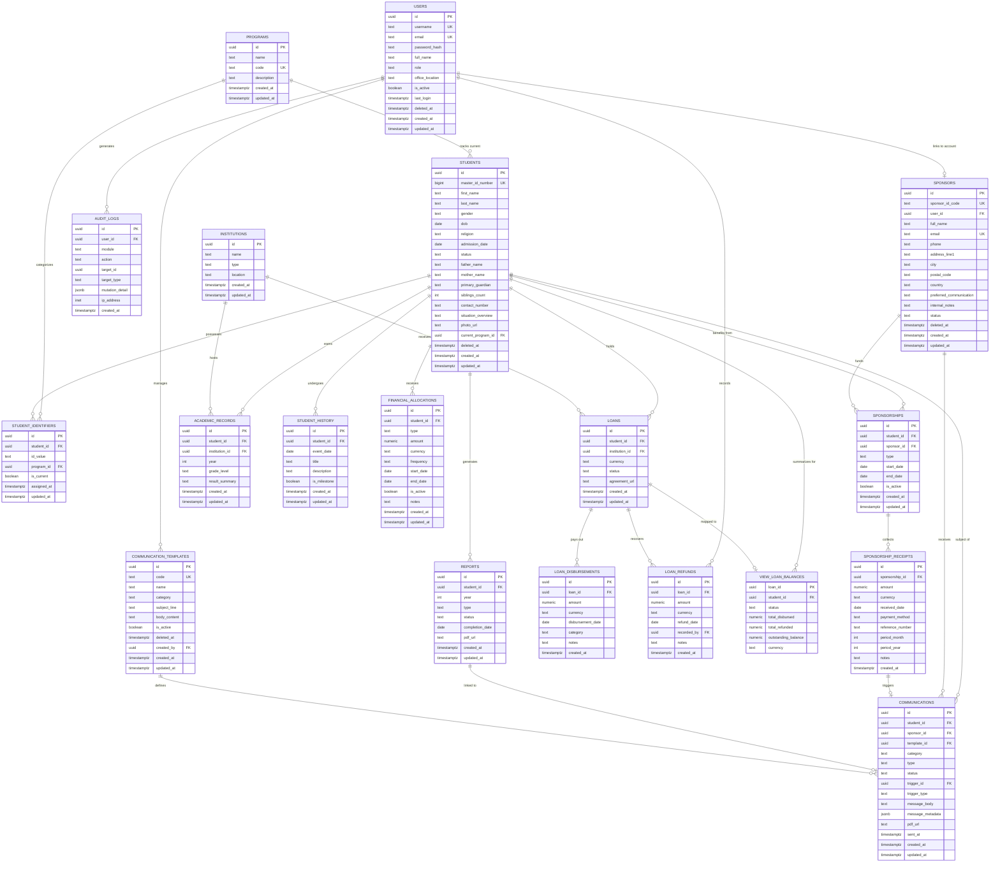

# Bangla Hope SMS - ER Diagram

Below is the live-rendered Entity Relationship Diagram (ERD) for the upgraded PostgreSQL database schema.

```mermaid
erDiagram
    %% ==========================================
    %% REFERENCE TABLES
    %% ==========================================
    PROGRAMS {
        uuid id PK
        text name
        text code UK
        text description
        timestamptz created_at
        timestamptz updated_at
    }

    INSTITUTIONS {
        uuid id PK
        text name
        text type
        text location
        timestamptz created_at
        timestamptz updated_at
    }

    %% ==========================================
    %% USER & AUDIT
    %% ==========================================
    USERS {
        uuid id PK
        text username UK
        text email UK
        text password_hash
        text full_name
        text role
        text office_location
        boolean is_active
        timestamptz last_login
        timestamptz deleted_at
        timestamptz created_at
        timestamptz updated_at
    }

    AUDIT_LOGS {
        uuid id PK
        uuid user_id FK
        text module
        text action
        uuid target_id
        text target_type
        jsonb mutation_detail
        inet ip_address
        timestamptz created_at
    }

    %% ==========================================
    %% STUDENT CORE
    %% ==========================================
    STUDENTS {
        uuid id PK
        bigint master_id_number UK
        text first_name
        text last_name
        text gender
        date dob
        text religion
        date admission_date
        text status
        text father_name
        text mother_name
        text primary_guardian
        int siblings_count
        text contact_number
        text situation_overview
        text photo_url
        uuid current_program_id FK
        timestamptz deleted_at
        timestamptz created_at
        timestamptz updated_at
    }

    STUDENT_IDENTIFIERS {
        uuid id PK
        uuid student_id FK
        text id_value
        uuid program_id FK
        boolean is_current
        timestamptz assigned_at
        timestamptz updated_at
    }

    %% ==========================================
    %% SPONSORSHIP SYSTEM
    %% ==========================================
    SPONSORS {
        uuid id PK
        text sponsor_id_code UK
        uuid user_id FK
        text full_name
        text email UK
        text phone
        text address_line1
        text city
        text postal_code
        text country
        text preferred_communication
        text internal_notes
        text status
        timestamptz deleted_at
        timestamptz created_at
        timestamptz updated_at
    }

    SPONSORSHIPS {
        uuid id PK
        uuid student_id FK
        uuid sponsor_id FK
        text type
        date start_date
        date end_date
        boolean is_active
        timestamptz created_at
        timestamptz updated_at
    }

    SPONSORSHIP_RECEIPTS {
        uuid id PK
        uuid sponsorship_id FK
        numeric amount
        text currency
        date received_date
        text payment_method
        text reference_number
        int period_month
        int period_year
        text notes
        timestamptz created_at
    }

    %% ==========================================
    %% RECORDS & HISTORY
    %% ==========================================
    ACADEMIC_RECORDS {
        uuid id PK
        uuid student_id FK
        uuid institution_id FK
        int year
        text grade_level
        text result_summary
        timestamptz created_at
        timestamptz updated_at
    }

    REPORTS {
        uuid id PK
        uuid student_id FK
        int year
        text type
        text status
        date completion_date
        text pdf_url
        timestamptz created_at
        timestamptz updated_at
    }

    STUDENT_HISTORY {
        uuid id PK
        uuid student_id FK
        date event_date
        text title
        text description
        boolean is_milestone
        timestamptz created_at
        timestamptz updated_at
    }

    FINANCIAL_ALLOCATIONS {
        uuid id PK
        uuid student_id FK
        text type
        numeric amount
        text currency
        text frequency
        date start_date
        date end_date
        boolean is_active
        text notes
        timestamptz created_at
        timestamptz updated_at
    }

    %% ==========================================
    %% LOAN SYSTEM
    %% ==========================================
    LOANS {
        uuid id PK
        uuid student_id FK
        uuid institution_id FK
        text currency
        text status
        text agreement_url
        timestamptz created_at
        timestamptz updated_at
    }

    LOAN_DISBURSEMENTS {
        uuid id PK
        uuid loan_id FK
        numeric amount
        text currency
        date disbursement_date
        text category
        text notes
        timestamptz created_at
    }

    LOAN_REFUNDS {
        uuid id PK
        uuid loan_id FK
        numeric amount
        text currency
        date refund_date
        uuid recorded_by FK
        text notes
        timestamptz created_at
    }

    VIEW_LOAN_BALANCES {
        uuid loan_id PK
        uuid student_id FK
        text status
        numeric total_disbursed
        numeric total_refunded
        numeric outstanding_balance
        text currency
    }

    COMMUNICATION_TEMPLATES {
        uuid id PK
        text code UK
        text name
        text category
        text subject_line
        text body_content
        boolean is_active
        timestamptz deleted_at
        uuid created_by FK
        timestamptz created_at
        timestamptz updated_at
    }

    COMMUNICATIONS {
        uuid id PK
        uuid student_id FK
        uuid sponsor_id FK
        uuid template_id FK
        text category
        text type
        text status
        uuid trigger_id FK
        text trigger_type
        text message_body
        jsonb message_metadata
        text pdf_url
        timestamptz sent_at
        timestamptz created_at
        timestamptz updated_at
    }

    %% ==========================================
    %% RELATIONSHIPS
    %% ==========================================
    USERS ||--o| SPONSORS : "links to account"
    USERS ||--o{ AUDIT_LOGS : "generates"
    USERS ||--o{ LOAN_REFUNDS : "records"
    USERS ||--o{ COMMUNICATION_TEMPLATES : "manages"

    PROGRAMS ||--o{ STUDENTS : "tracks current"
    PROGRAMS ||--o{ STUDENT_IDENTIFIERS : "categorizes"
    
    STUDENTS ||--o{ STUDENT_IDENTIFIERS : "possesses"
    STUDENTS ||--o{ ACADEMIC_RECORDS : "earns"
    STUDENTS ||--o{ REPORTS : "generates"
    STUDENTS ||--o{ STUDENT_HISTORY : "undergoes"
    STUDENTS ||--o{ FINANCIAL_ALLOCATIONS : "receives"
    STUDENTS ||--o{ SPONSORSHIPS : "benefits from"
    STUDENTS ||--o{ LOANS : "holds"
    STUDENTS ||--o{ VIEW_LOAN_BALANCES : "summarizes for"
    STUDENTS ||--o{ COMMUNICATIONS : "subject of"

    INSTITUTIONS ||--o{ ACADEMIC_RECORDS : "hosts"
    INSTITUTIONS ||--o{ LOANS : "receives funds at"

    SPONSORS ||--o{ SPONSORSHIPS : "funds"
    SPONSORS ||--o{ COMMUNICATIONS : "receives"

    SPONSORSHIPS ||--o{ SPONSORSHIP_RECEIPTS : "collects"
    SPONSORSHIP_RECEIPTS ||--o| COMMUNICATIONS : "triggers"
    REPORTS ||--o| COMMUNICATIONS : "linked to"
    COMMUNICATION_TEMPLATES ||--o{ COMMUNICATIONS : "defines"

    LOANS ||--o{ LOAN_DISBURSEMENTS : "pays out"
    LOANS ||--o{ LOAN_REFUNDS : "recovers"
    LOANS ||--o| VIEW_LOAN_BALANCES : "mapped to"
```
