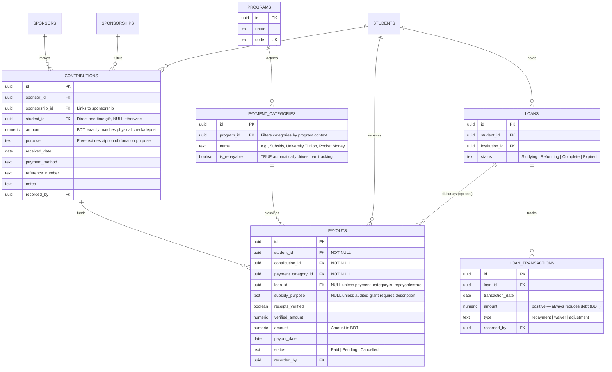

# Financial System Architecture & Workflow

This document serves as the comprehensive guide to the Bangla Hope Sponsorship Management System (SMS) financial components.



## Core Philosophy: The Manual Digital Ledger

The Bangla Hope SMS is designed as a **Manual Digital Ledger**.

* **Purpose:** Record-keeping, tracking sponsorships, and student accountability.
* **Limitation:** It is **not** a banking interface or payment gateway. It does not perform live bank transfers. All data must be verified and entered by authorized staff.

---

## 1. Income Tracking & Delayed Allocation

This module balances strict audit-matching for bank logs with flexible fund programming by separating the role of income entry from fund distribution.

### Key Components

* **`contributions` (The Physical Inflow):** Manually entered by the Secretary (**UC-10**). This must exactly match the value on the physical check or bank deposit in BDT. Optionally linked to a `sponsorship_id` and/or `student_id`. Includes an optional free-text `purpose` field for donation description.

### Financial Logic

1. **Recording Gifts:** When a contribution is confirmed via bank statement, staff log the total amount optionally linking it to a sponsorship or specific student.
2. **Recency Analysis:** The system monitors the date of the most recent gift from a sponsor. If no support is recorded within **6 months**, the linked student is flagged as "Action Required" on the master registry.

---

## 2. Expenditure Tracking: Adaptive Program Rules

To eliminate data entry errors by ground coordinators, payouts are dynamically governed by the student's program track rather than a global, rigid set of hardcoded types.

### A. Contextual Payment Categories

Instead of forcing a global selection of `pocket_money | subsidy | loan`, the system implements a master `payment_categories` registry linked to `programs`.

* If a student is in the **Higher Education Program**, their available selections filter exclusively to program-allowed types (e.g., `University Tuition`, `Boarding Rent`). Because these categories carry `is_repayable = true`, the application enforces the linkage of an active `loan_id`.
* If a student is in a primary school track (**VLG**), the available selections filter down to `Tuition Subsidy`, `Textbook Grant`, or `Uniform Allowance`. These have `is_repayable = false`, instantly hiding debt mechanics from the data entry form.

### B. Higher Education Loan Program (Repayable Track)

Designed to assist students through university via a revolving fund model.

* **`loans` (The Balance Registry):** Tracks the total outstanding debt, status, and graduation terms.
* **`payouts` (The Outflow):** When a payout is processed via a repayable category, it requires a `loan_id` and directly increases the running ledger balance of that loan track.
* **`loan_transactions` (The Inflow):** Records cash repayments, structural waivers, or year-end adjustments made by graduates back to the organization, reducing the outstanding liability.

---

## 3. Governance, Integrity, & Audit

### Currency Handling

All financial tracking uses a single currency:

* **All records (Contributions, Payouts, Loan Transactions):** Tracked in **BDT (৳)** — Bangladeshi Taka. No dual-currency conversion or exchange rate tracking is needed.
* **Rationale:** Bangla Hope receives funds from the sponsor's US office already converted to BDT. All internal operations, payouts, and accounting are conducted in BDT. Reporting to the US office is handled separately through generated PDF reports, not live exchange rate data.
* **No exchange_rates table:** The `exchange_rates` table and all exchange-rate-related columns (`local_amount`, `exchange_rate`) have been removed from the schema. All `amount` columns across `contributions`, `payouts`, and `loan_transactions` are in BDT.

### Overdraft Enforcement

A database trigger (`fn_enforce_payout_limits`) runs on every payout `INSERT` or `UPDATE`. It locks the parent `contribution` row (`SELECT ... FOR UPDATE`), sums all existing payouts tied to that contribution, and rejects the transaction if the new total exceeds the contribution amount:

$$\sum(\text{payouts.amount}) \le \text{contribution.amount}$$

### The Audit Trail (`audit_logs`)

The system follows a policy of **non-deletion**. Financial records must never be deleted.

* **Audit Logging:** Every single `INSERT`, `UPDATE`, or `DELETE` attempt on financial data is logged with the user ID, timestamp, and a JSON snapshot of the mutation.
* **Accountability:** If a record is wrong, it is "corrected" by adding a new record that offsets the previous one, maintaining a perfect history of the correction for future audits.

---

## 4. Financial Tracking Reports

The system supports two financial report types, both generated as simple ledger-style PDFs following the standard report workflow (Draft → Approved → Complete).

### A. Student Financial Report (per student)

Running balance for a single student showing all contributions and payouts:

```
Student: Abdur Rahman — LRC (ID: 202600000001)
Sponsor: John & Sarah Miller
Period: Jan 2026 – Jun 2026

Date        | Description                  | In (BDT)  | Out (BDT) | Balance
------------+------------------------------+-----------+-----------+--------
Jan 15 2026 | Contribution - Sponsor       |  10,000   |           |  10,000
Jan 20 2026 | Subsidy                      |           |   3,000   |   7,000
Feb 15 2026 | Contribution - Sponsor       |  10,000   |           |  17,000
Feb 25 2026 | Pocket Money                 |           |   1,500   |  15,500
Jun 10 2026 | Tuition                      |           |   8,000   |   7,500
------------+------------------------------+-----------+--------+--------
Total       |                              |  20,000   |  12,500  |   7,500
```

### B. Financial Tracking Record (per contribution)

Breakdown of a single contribution showing what it funded:

```
Contribution: #c4a7e2... — 100,000 BDT
Sponsor: John & Sarah Miller
Received: Jan 15 2026

Student          | Program | Category        | Amount (BDT)
-----------------+---------+-----------------+-------------
Abdur Rahman     | LRC     | Subsidy         |  15,000
Fatima Begum     | LRC     | Subsidy         |  15,000
Rafiq Hasan      | BRD     | Boarding Fee    |  30,000
Ayesha Khatun    | VLG     | Tuition Subsidy |   8,000
-----------------+---------+-----------------+-------------
Total Allocated  |         |                 |  68,000
Remaining Balance|         |                 |  32,000
```

Both report types use the `reports` table with `type = 'Financial Tracking'`. The application context (per-student vs per-contribution) is determined by whether `student_id` or `contribution_id` is set.

---

## 5. Summary Table

| Category | Component | Currency | Tracking & Validation Method |
| --- | --- | --- | --- |
| **Income Intake** | Contributions | **BDT (৳)** | Matches physical bank deposit records. Optional `purpose` field for free-text description. |
| **Expenditure** | Payouts (Per-Student) | **BDT (৳)** | Single-currency ledger tracking. Dropdown options filter contextually via `payment_categories`. |
| **Debt Track** | Higher Education | **BDT (৳)** | Loan Disbursements (`payouts`) vs. Outbound Transactions (`loan_transactions`). |
| **Overdraft Check** | Database Trigger | **BDT (৳)** | Validates that total payouts do not exceed the parent contribution amount. |

---
*Last Updated: 2026-06-11 | Part of the Bangla Hope SMS Technical Blueprint*
