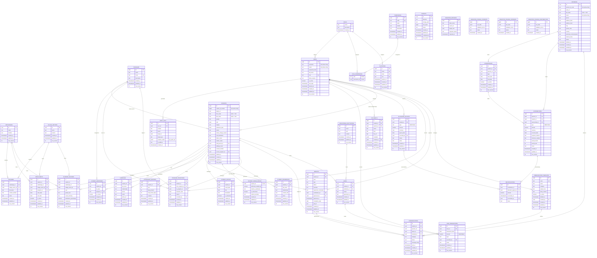

```mermaid
erDiagram
    %% ==========================================
    %% 1. SYSTEM & SECURITY
    %% ==========================================
    ROLES {
        text name PK
        text description
        timestamptz created_at
    }

    PROGRAMS {
        uuid id PK
        text name
        text code UK
        text description
        timestamptz created_at
        timestamptz updated_at
        int row_version
    }

    ORPHANAGES {
        uuid id PK
        text name
        text location
        timestamptz created_at
        timestamptz updated_at
        int row_version
    }

    VILLAGE_SECTORS {
        uuid id PK
        text name
        text location
        timestamptz created_at
        timestamptz updated_at
        int row_version
    }

    TEACHERS {
        uuid id PK
        uuid orphanage_id FK
        uuid village_sector_id FK
        text full_name
        text contact_number
        text email
        timestamptz created_at
        timestamptz updated_at
        int row_version
    }

    PERMISSIONS {
        uuid id PK
        text code UK
        text name
        text module
        text description
        timestamptz created_at
        timestamptz updated_at
        int row_version
    }

    USERS {
        uuid id PK
        text username "UK (Active Only)"
        text email "UK (Active Only)"
        text password_hash
        text full_name
        text role FK
        text office_location
        boolean is_active
        timestamptz last_login
        timestamptz deleted_at
        timestamptz created_at
        timestamptz updated_at
        int row_version
    }

    ROLE_PERMISSIONS {
        text role PK, FK
        uuid permission_id PK, FK
    }

    AUDIT_LOGS {
        uuid id PK
        uuid user_id FK
        text module
        text action
        uuid target_id
        text target_type
        jsonb mutation_detail "gin_path_ops"
        inet ip_address
        timestamptz created_at
    }

    BACKUPS {
        uuid id PK
        text filename
        text storage_path
        bigint size_bytes
        text status
        timestamptz created_at
        timestamptz updated_at
        timestamptz completed_at
        int row_version
    }

    %% ==========================================
    %% 2. STUDENT CORE
    %% ==========================================
    STUDENTS {
        uuid id PK
        bigint master_id_number "UK (Active Only)"
        text legacy_id
        text first_name "LEN <= 100"
        text last_name "LEN <= 100"
        text gender
        date dob
        text religion
        date admission_date
        text status
        text status_change_reason
        text exit_destination
        text father_name
        text mother_name
        uuid staff_parent_id FK
        int siblings_count
        text contact_number
        uuid current_program_id FK
        timestamptz deleted_at
        timestamptz created_at
        timestamptz updated_at
        int row_version
    }

    STUDENT_INTAKE_DETAILS {
        uuid student_id PK, FK
        numeric admission_weight_kg
        text health_at_admission
        boolean is_immunized
        text referral_narrative
        timestamptz created_at
        timestamptz updated_at
        int row_version
    }

    STUDENT_REFERENCES {
        uuid id PK
        uuid student_id FK
        text full_name
        text relationship
        text contact_info
        text notes
        timestamptz created_at
        timestamptz updated_at
        int row_version
    }

    PROGRAM_TRANSITIONS {
        uuid id PK
        uuid student_id FK
        uuid from_program_id FK
        uuid to_program_id FK
        date transition_date
        text reason
        uuid recorded_by FK
        timestamptz created_at
        timestamptz updated_at
        int row_version
    }

    GUARDIANS {
        uuid id PK
        uuid student_id FK
        text full_name
        text relationship
        text phone
        text email
        text photo_url
        timestamptz created_at
        timestamptz updated_at
        int row_version
    }

    ENROLLMENTS {
        uuid id PK
        uuid student_id FK
        uuid orphanage_id FK
        uuid village_sector_id FK
        uuid program_id FK
        date start_date
        date end_date
        boolean is_active
        timestamptz created_at
        timestamptz updated_at
        int row_version
    }

    STUDENT_IDENTIFIERS {
        uuid id PK
        uuid student_id FK
        text id_value
        uuid program_id FK
        boolean is_current
        timestamptz assigned_at
        timestamptz updated_at
        int row_version
    }

    DOCUMENTS {
        uuid id PK
        uuid student_id FK
        uuid sponsor_id FK
        text name
        text type
        text file_url
        jsonb metadata
        uuid created_by FK
        timestamptz created_at
        timestamptz updated_at
        int row_version
    }

    %% ==========================================
    %% 3. MIGRATION LAYER
    %% ==========================================
    MIGRATION_METADATA {
        uuid id PK
        text table_name
        text source_id
        uuid target_uuid
        text migration_batch
        timestamptz migrated_at
    }

    MIGRATION_STAGING_STUDENTS {
        bigint id PK
        jsonb raw_data
        text validation_errors
        text status
        timestamptz created_at
    }

    MIGRATION_STAGING_SPONSORS {
        bigint id PK
        jsonb raw_data
        text validation_errors
        text status
        timestamptz created_at
    }

    MIGRATION_STAGING_CONTRIBUTIONS {
        bigint id PK
        jsonb raw_data
        text validation_errors
        text status
        timestamptz created_at
    }

    %% ==========================================
    %% 4. SPONSORSHIP SYSTEM
    %% ==========================================
    INVITATIONS {
        uuid id PK
        text email UK
        text token UK
        text role FK
        timestamptz expires_at
        timestamptz created_at
        timestamptz updated_at
        int row_version
    }

    SPONSORS {
        uuid id PK
        text sponsor_id_code "UK (Active Only)"
        uuid user_id FK
        text full_name "LEN <= 200"
        text email "UK (Active Only)"
        text phone
        text address_line1
        text address_line2
        text city
        text postal_code
        text country
        text preferred_communication
        text internal_notes
        text status
        timestamptz deleted_at
        timestamptz created_at
        timestamptz updated_at
        int row_version
    }

    SPONSORSHIPS {
        uuid id PK
        uuid student_id FK
        uuid sponsor_id FK
        text type
        date start_date
        date end_date
        boolean is_active
        timestamptz created_at
        timestamptz updated_at
        int row_version
    }

    CONTRIBUTIONS {
        uuid id PK
        uuid sponsor_id FK
        uuid student_id FK
        uuid sponsorship_id FK
        text type "IMMUTABLE"
        numeric amount
        char currency
        date received_date
        text payment_method
        text reference_number
        int period_month
        int period_year
        text notes
        timestamptz created_at
        timestamptz updated_at
        int row_version
    }

    COMMUNICATION_TEMPLATES {
        uuid id PK
        text code UK
        text name
        text category
        text subject_line
        text body_content
        boolean is_active
        timestamptz deleted_at
        uuid created_by FK
        timestamptz created_at
        timestamptz updated_at
        int row_version
    }

    COMMUNICATIONS {
        uuid id PK
        uuid student_id FK
        uuid sponsor_id FK
        uuid report_id FK
        uuid template_id FK
        text category
        text status
        text message_body
        timestamptz sent_at
        timestamptz created_at
        timestamptz updated_at
        int row_version
    }

    %% ==========================================
    %% 5. RECORDS & HISTORY
    %% ==========================================
    ACADEMIC_RECORDS {
        uuid id PK
        uuid student_id FK
        uuid orphanage_id FK
        uuid village_sector_id FK
        int year
        text grade_level
        text result_summary
        numeric attendance_percentage
        timestamptz created_at
        timestamptz updated_at
        int row_version
    }

    ATTENDANCE_RECORDS {
        uuid id PK
        uuid student_id FK
        int year
        int days_present
        int total_school_days
        text remarks
        timestamptz created_at
        timestamptz updated_at
        int row_version
    }

    REPORTS {
        uuid id PK
        uuid student_id FK
        int year
        text type
        text status
        text narrative
        text supervisor_comments
        uuid contribution_id FK
        uuid approved_by FK
        timestamptz approved_at
        date completion_date
        text pdf_url
        timestamptz created_at
        timestamptz updated_at
        int row_version
    }

    STUDENT_HISTORY {
        uuid id PK
        uuid student_id FK
        date event_date
        text title
        text description
        boolean is_milestone
        timestamptz created_at
        timestamptz updated_at
        int row_version
    }

    ALLOCATION_PAYOUTS {
        uuid id PK
        uuid student_id FK
        text type "IMMUTABLE"
        numeric amount
        char currency
        date payout_date
        uuid recorded_by FK
        text status
        text notes
        timestamptz created_at
        timestamptz updated_at
        int row_version
    }

    RECONCILIATIONS {
        uuid id PK
        uuid contribution_id FK
        uuid allocation_payout_id FK
        numeric amount
        timestamptz reconciled_at
        uuid reconciled_by FK
        text notes
    }

    %% ==========================================
    %% 6. LOAN SYSTEM
    %% ==========================================
    EDUCATIONAL_INSTITUTIONS {
        uuid id PK
        text name
        text type
        text location
        timestamptz created_at
        timestamptz updated_at
        int row_version
    }

    LOANS {
        uuid id PK
        uuid student_id FK
        uuid institution_id FK
        text status
        text agreement_url
        timestamptz created_at
        timestamptz updated_at
        int row_version
    }

    LOAN_TRANSACTIONS {
        uuid id PK
        uuid loan_id FK
        date transaction_date
        numeric amount "IMMUTABLE"
        text type
        uuid recorded_by FK
        text notes
        timestamptz created_at
        timestamptz updated_at
        int row_version
    }

    %% ==========================================
    %% RELATIONSHIPS (All child links use ON DELETE RESTRICT)
    %% ==========================================
    ROLES ||--o{ USERS : "defines"
    ROLES ||--o{ ROLE_PERMISSIONS : "assigned"
    ROLES ||--o{ INVITATIONS : "targeted"
    
    USERS ||--o{ AUDIT_LOGS : "generates"
    USERS ||--o{ LOAN_TRANSACTIONS : "records"
    USERS ||--o{ DOCUMENTS : "uploads"
    USERS ||--o{ ALLOCATION_PAYOUTS : "records"
    USERS ||--o{ STUDENTS : "parent of (Staff Child)"
    USERS ||--o{ PROGRAM_TRANSITIONS : "records"
    USERS ||--o{ REPORTS : "approves"
    USERS ||--o{ COMMUNICATION_TEMPLATES : "manages"

    PERMISSIONS ||--o{ ROLE_PERMISSIONS : "assigned to"
    
    PROGRAMS ||--o{ STUDENTS : "tracks current"
    PROGRAMS ||--o{ STUDENT_IDENTIFIERS : "categorizes"
    PROGRAMS ||--o{ PROGRAM_TRANSITIONS : "source of"
    PROGRAMS ||--o{ PROGRAM_TRANSITIONS : "target of"
    
    ORPHANAGES ||--o{ TEACHERS : "employs"
    VILLAGE_SECTORS ||--o{ TEACHERS : "employs"
    
    STUDENTS ||--o{ GUARDIANS : "has"
    STUDENTS ||--o{ ENROLLMENTS : "enrolled in"
    STUDENTS ||--o{ STUDENT_IDENTIFIERS : "possesses"
    STUDENTS ||--o{ ACADEMIC_RECORDS : "earns"
    STUDENTS ||--o{ ATTENDANCE_RECORDS : "tracks"
    STUDENTS ||--o{ REPORTS : "generates"
    STUDENTS ||--o{ STUDENT_HISTORY : "undergoes"
    STUDENTS ||--o| STUDENT_INTAKE_DETAILS : "has intake data"
    STUDENTS ||--o{ STUDENT_REFERENCES : "referred by"
    STUDENTS ||--o{ PROGRAM_TRANSITIONS : "undergoes"
    STUDENTS ||--o{ COMMUNICATIONS : "subject of"
    STUDENTS ||--o{ LOANS : "holds"

    ORPHANAGES ||--o{ ENROLLMENTS : "hosts"
    VILLAGE_SECTORS ||--o{ ENROLLMENTS : "hosts"
    ORPHANAGES ||--o{ ACADEMIC_RECORDS : "hosts"
    VILLAGE_SECTORS ||--o{ ACADEMIC_RECORDS : "hosts"

    SPONSORS ||--o{ SPONSORSHIPS : "funds"
    SPONSORS ||--o{ CONTRIBUTIONS : "makes"
    SPONSORS ||--o{ COMMUNICATIONS : "receives"
    SPONSORSHIPS ||--o{ CONTRIBUTIONS : "fulfills"

    CONTRIBUTIONS ||--o{ RECONCILIATIONS : "reconciled by"
    ALLOCATION_PAYOUTS ||--o{ RECONCILIATIONS : "reconciled by"

    LOANS ||--o{ LOAN_TRANSACTIONS : "tracks"
    EDUCATIONAL_INSTITUTIONS ||--o{ LOANS : "hosts"
    
    COMMUNICATION_TEMPLATES ||--o{ COMMUNICATIONS : "defines"
    REPORTS ||--o{ COMMUNICATIONS : "delivered via"
```