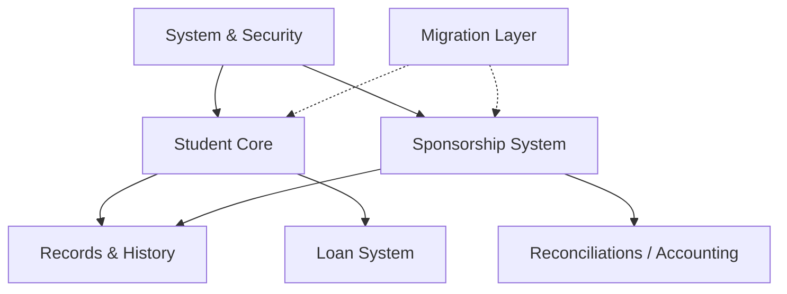

# Bangla Hope Sponsorship Management System (SMS)
## Entity Relationship Diagram (ERD) Architectural Explanation

This document provides a comprehensive breakdown of the entity relationships and data architecture defined in [ERD.mmd](file:///c:/Users/Pann/Documents/New%20folder%20(5)/Bangla_Hope_Blueprint/technical/ERD.mmd) and implemented in [schema.sql](file:///c:/Users/Pann/Documents/New%20folder%20(5)/Bangla_Hope_Blueprint/technical/schema.sql).

---

## 1. High-Level Architectural Modules

The database schema is organized into six functional modules that form the backbone of the Bangla Hope Sponsorship Management System:

---

## 2. Detailed Module Breakdown

### 2.1 System & Security (Auth & Administration)
This module regulates user authorization, administrative operations, system tasks, and audit trails.

* **`ROLES` & `PERMISSIONS`:** Implements fine-grained **Role-Based Access Control (RBAC)**. Roles (such as *Admin*, *Supervisor*, *Coordinator*, *Secretary*, *Sponsor*) are linked to specific atomic capabilities (e.g., `STUDENT_CREATE`) via the junction table **`ROLE_PERMISSIONS`**.
* **`USERS`:** The system identity registry for staff and administrators. 
  * Integrates with **`ROLES`** to define user permissions.
  * Employs soft deletes (`deleted_at`) paired with active-only unique constraints to support email and username reuse.
* **`INVITATIONS`:** Governs onboarding of new administrative users or sponsors via time-limited registration tokens.
* **`AUDIT_LOGS`:** Captures mutation histories, target object changes (via structured `JSONB`), operator IP addresses, and timestamps. It is partitioned by creation date for high-volume database performance.
* **`JOB_QUEUE`:** An asynchronous task runner for resource-intensive background processes, such as generating PDF reports or sending outbound emails.
* **`BACKUPS`:** Logs administrative database backup activities, including file storage paths, sizing metadata, and run statuses.

---

### 2.2 Student Core & Enrollment
The operational heart of the application, tracking children from their initial intake through various care programs.

* **`STUDENTS`:** The central master table. 
  * Features a mathematical prefix formula that generates sequential, non-truncating, human-readable ID values (e.g., `202600000001`).
  * Employs soft deletes to keep historical records intact if a student is removed.
  * Connects to **`USERS`** via `staff_parent_id` for children of Bangla Hope employees.
* **`STUDENT_INTAKE_DETAILS`:** A 1-to-1 extension of the `STUDENTS` table, housing specific details collected at admission (admission weight, foundational health, immunization status, referral narratives). Moving these large narratives here keeps queries on the primary student directory highly optimized.
* **`GUARDIANS` & `STUDENT_REFERENCES`:** Tracks immediate family structures and external recommenders (e.g., village leaders, pastors) who vetted the child.
* **`PROGRAMS`:** Registers the organization's sponsorship verticals:
  1. *LRC* (Love Receiving Center - Residential Care)
  2. *BRD* (Boarding School)
  3. *VLG* (Community Day Schools)
  4. *LON* (Higher Education Loans)
  5. *STF* (Employee Children)
* **`ENROLLMENTS`:** A timeline ledger registering where a child is placed, linking them to a program, an **`ORPHANAGES`** campus, or a **`VILLAGE_SECTORS`** school over time.
* **`STUDENT_IDENTIFIERS`:** Stores historical and department-specific custom formatting codes (e.g., `#LRC-0124`) that adjust as students transfer programs.
* **`PROGRAM_TRANSITIONS`:** Tracks the operational transitions as students age out of primary care and advance to higher tracks.
* **`DOCUMENTS`:** Manages legal verification documents, birth certificates, and signed agreements stored via cloud storage links.

---

### 2.3 Migration Layer
An isolated staging area designed for dry-running, sanitizing, and importing legacy data (from MS Access or Excel) into the production schema.

* **`MIGRATION_STAGING_STUDENTS`**, **`MIGRATION_STAGING_SPONSORS`**, & **`MIGRATION_STAGING_CONTRIBUTIONS`** store raw source data inside flexible `JSONB` blobs. 
* Validation scripts evaluate constraints and write warnings to the `validation_errors` field, ensuring database engineers can clean up legacy records before importing them.
* **`MIGRATION_METADATA`** maps original string-based primary keys from legacy databases to new system-generated UUIDs, maintaining historical cross-referencing capabilities.

---

### 2.4 Sponsorship System (Donor Management)
Manages external donors, active sponsorships, and incoming donations.

* **`SPONSORS`:** Holds donor profiles, communication preferences, and contact details. It maps back to a portal access account in **`USERS`**.
* **`SPONSORSHIPS`:** The critical junction table matching a **`SPONSOR`** to a **`STUDENT`**.
  * Classifies the sponsorship type (e.g., *Primary* or *Co-Sponsor*).
  * Employs a unique partial index to ensure a sponsor cannot hold duplicate active sponsorships for the same child simultaneously.
* **`CONTRIBUTIONS`:** The general financial ledger tracking incoming revenue in BDT. Each record exactly matches a physical check or bank deposit — no splits, no earmarks. Includes an optional free-text `purpose` field.
  * **Immutability:** This ledger is designed to be immutable; it lacks an update trigger, guaranteeing financial records cannot be manipulated after entry.
  * **Direct Payout Link:** Payouts draw directly from a contribution via `contribution_id`. The student's `current_program_id` provides the program context for filtering payment categories.
* **`COMMUNICATIONS` & `COMMUNICATION_TEMPLATES`:** Manages automated and manual outreach to sponsors (e.g., receipts, letters, or PDF reports) across various delivery channels (Email, Postal Mail, SMS).

---

### 2.5 Records, Academic History & Progress
Monitors student growth, performance, field expenses, and double-entry financial reconciliation.

* **`ACADEMIC_RECORDS` & `ATTENDANCE_RECORDS`:** Logs annual school results, grades, and attendance metrics. 
  * Academic records are linked to **`PROGRAMS`**, **`ORPHANAGES`**, **`VILLAGE_SECTORS`**, and **`EDUCATIONAL_INSTITUTIONS`** to provide a continuous academic history as a student moves between care models.
  * Attendance records are partitioned by date for database performance.
* **`REPORTS`:** Tracks annual progress reports (APRs), case narratives, and birthday letters. Reports require supervisor approval before generating final outbound PDFs.
* **`PAYOUTS`:** Tracks every individual payout to a student — drawing directly from a `contribution` via `contribution_id`. Each payout is classified via `payment_category_id` (contextual to the student's program, e.g., `University Tuition` for LON, `Tuition Subsidy` for VLG). If the linked `payment_category` has `is_repayable = true`, a `loan_id` is required. An overdraft trigger (`fn_enforce_payout_limits`) prevents payouts from exceeding the contribution amount. This ledger is structurally immutable.

---

### 2.6 Loan System (Higher Education)
A specialized financing system for older students who transition from direct sponsorship to repayable university funding.

* **`EDUCATIONAL_INSTITUTIONS`:** Standardizes a lookup table of universities, vocational schools, and technical colleges.
* **`LOANS`:** Tracks active loans, statuses (e.g., *Studying*, *Refunding*, *Complete*).
* **`LOAN_TRANSACTIONS`:** An immutable double-entry ledger tracking repayments (positive amounts reducing debt in BDT), waivers, and adjustments. Disbursements live in **`PAYOUTS`** — when the linked `payment_category.is_repayable = true`, a `loan_id` is required and the payout counts as a loan disbursement. This separation keeps the expense trail distinct from the debt-reduction trail.
* **`PAYOUTS.loan_id`:** Required when `payment_category.is_repayable = true` (enforced by trigger `trg_ensure_loan_consistency`). A loan can have multiple payouts (e.g., semester tuition installments).

---

## 3. Core Database Safeguards & Rules

### 3.1 Referential Integrity
* **`ON DELETE RESTRICT`:** The ERD enforces a strict rule: child relationships use `ON DELETE RESTRICT` for key structural records. This prevents the deletion of a student or sponsor if they are associated with existing histories, communications, contributions, or transitions. This is critical for keeping audit trails intact.
* **`ON DELETE SET NULL`:** Used for non-destructive relational fields (e.g., if a staff member's account in **`USERS`** is deleted, their recorded actions in transitions or document uploads remain intact, with the author field cleanly set to `NULL`).

### 3.2 Financial Safeguards
The schema implements two automated safeguards:

1. **Payout Overdraft (`fn_enforce_payout_limits`):** When a `payouts` row is inserted or updated, the trigger locks the parent `contribution` row (`SELECT ... FOR UPDATE`). It aggregates all existing payouts and ensures the new total does not exceed the contribution amount.

2. **Loan Consistency (`fn_enforce_loan_consistency`):** When a payout is inserted or updated, the trigger checks the linked `payment_category.is_repayable` flag. Repayable categories require a `loan_id`; non-repayable categories reject one.

Each trigger serializes concurrent writes and rejects violations with a descriptive database exception.

### 3.3 Optimistic Concurrency Control (OCC)
* System tables include a `row_version` integer and an `updated_at` timestamp.
* An automated trigger function (**`fn_update_timestamp`**) intercepts update statements to increment the `row_version` and update the timestamp. This allows the application server to detect and reject concurrent overwrites (e.g., if two coordinators edit the same student record at the same time).
