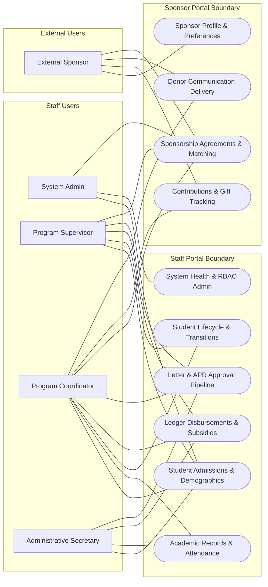
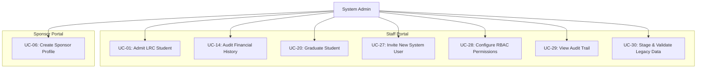
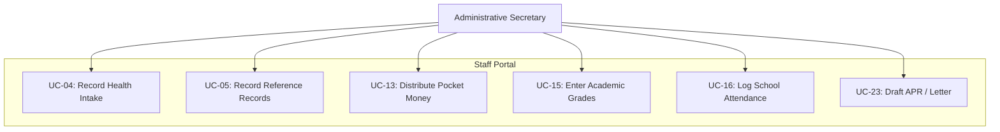
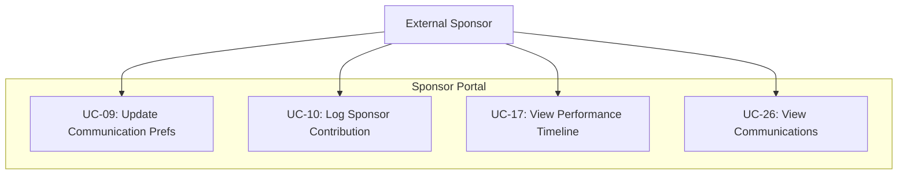
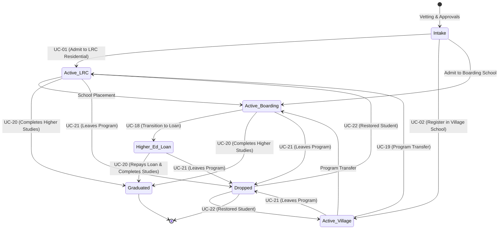
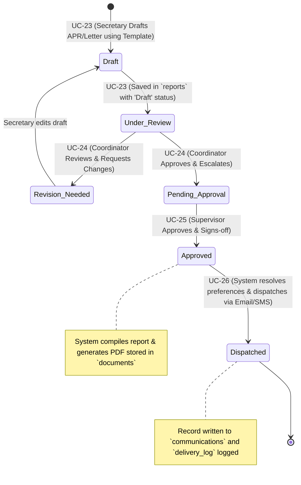
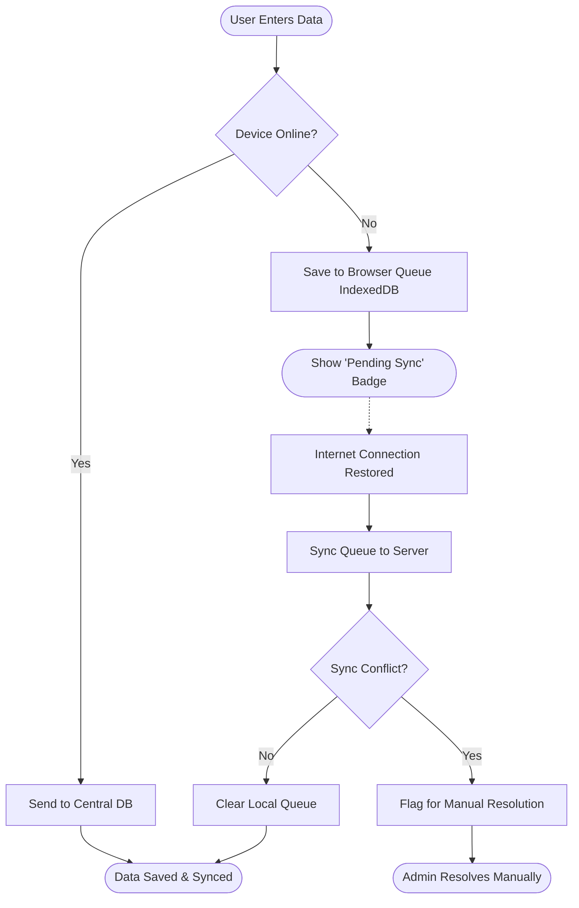

# Bangla Hope Sponsorship Management System (Bangla Hope SMS)
## Operational Use Cases and System Diagrams

This document contains 30 comprehensive operational use cases and system diagrams for the **Bangla Hope SMS**, mapping the system's requirements, database triggers, constraints, and workflows to specific user roles and technical processes.

---

## 1. System Actors & Roles

The system operates under a strict **Role-Based Access Control (RBAC)** model defined in [PERMISSIONS.md](file:///c:/Users/Pann/Documents/New%20folder%20(5)/Bangla_Hope_Blueprint/technical/PERMISSIONS.md). The key actors are:

*   **Admin:** The system owner with full data access, account configuration, data staging execution, and override capabilities.
*   **Supervisor:** The quality control gatekeeper. Approves student status changes (Drops/Archiving), signs off on communications (APRs/Letters), and manages financial disbursements.
*   **Coordinator:** The primary system operator. Links sponsorships, records daily financial contributions, manages student history profiles, and escalates communications.
*   **Secretary:** The administrative support staff. Handles data entry for demographics, inputs academic results and attendance logs, and drafts sponsor letters.
*   **Sponsor:** External donors who access their personal profiles, view sponsored student information, and read/download approved letters.

---

## 2. 30 Operational Use Cases

### Category A: Core Student Management & Admissions

#### UC-01: Admit a Child into LRC Residential Care
*   **Primary Actor:** Supervisor / Admin
*   **Preconditions:** The child is approved for the Love Receiving Center (LRC) program.
*   **Main Flow:**
    1. The Supervisor navigates to the LRC module and clicks **Add New Kid**.
    2. Enters demographic data (name, birth date, gender) and selects the residential campus orphanage.
    3. Submits the form.
    4. The database triggers `trg_assign_student_id` which pulls from `student_master_id_seq` to assign a safe master identification number (e.g., `202600000001`).
    5. The system auto-inserts an active enrollment row into the `enrollments` table mapping the child to the LRC program.
*   **Postconditions:** The student is created with a unique Master ID and marked `Active`.
*   **Schema References:** [students](file:///c:/Users/Pann/Documents/New%20folder%20(5)/Bangla_Hope_Blueprint/technical/schema.sql#L137), [enrollments](file:///c:/Users/Pann/Documents/New%20folder%20(5)/Bangla_Hope_Blueprint/technical/schema.sql#L190).

#### UC-02: Register a Student in a Village School (Day School)
*   **Primary Actor:** School Supervisor
*   **Preconditions:** The student lives in one of the community village sectors.
*   **Main Flow:**
    1. The School Supervisor opens the Village Schools module and clicks **Add Student**.
    2. Inputs demographic information and selects a designated `village_sector_id` and class level.
    3. Submits the form.
    4. The database generates a Master ID and inserts a record into `students`.
    5. The system auto-generates an enrollment record linked to the "Village Schools" program.
*   **Postconditions:** Student is enrolled in a village day school.
*   **Schema References:** [students](file:///c:/Users/Pann/Documents/New%20folder%20(5)/Bangla_Hope_Blueprint/technical/schema.sql#L137), [village_sectors](file:///c:/Users/Pann/Documents/New%20folder%20(5)/Bangla_Hope_Blueprint/technical/schema.sql#L71).

#### UC-03: Add a Biological or Legal Guardian Profile
*   **Primary Actor:** Coordinator / Supervisor
*   **Preconditions:** The student record already exists in the database.
*   **Main Flow:**
    1. The user navigates to the student details page and clicks **Add Guardian**.
    2. Inputs guardian information (name, relationship, national ID number, contact number) and uploads an identity picture.
    3. Clicks **Save**.
    4. The system validates formatting and inserts a row into `guardians` linked via `student_id`.
*   **Postconditions:** Guardian profile is linked to the student.
*   **Schema References:** [guardians](file:///c:/Users/Pann/Documents/New%20folder%20(5)/Bangla_Hope_Blueprint/technical/schema.sql#L164).

#### UC-04: Record Student Baseline Health and Intake Metrics
*   **Primary Actor:** Secretary / Coordinator
*   **Preconditions:** Student profile has been created.
*   **Main Flow:**
    1. The Secretary opens the student's record and selects **Case History / Intake Details**.
    2. Inputs intake metrics: baseline height, weight, immunization checks, dental health status, and developmental narrative text.
    3. Clicks **Save Intake Details**.
    4. The system updates the 1-to-1 extension table `student_intake_details`.
*   **Postconditions:** Medical baseline details are recorded without bloating the main `students` index.
*   **Schema References:** [student_intake_details](file:///c:/Users/Pann/Documents/New%20folder%20(5)/Bangla_Hope_Blueprint/technical/schema.sql#L178).

#### UC-05: Record Academic and Clerical Reference Records
*   **Primary Actor:** Secretary
*   **Preconditions:** Student profile exists.
*   **Main Flow:**
    1. The Secretary opens the student's profile and navigates to **Reference Records**.
    2. Registers recommending organizations or local figures (village pastor, community leader, local committee) who vetted the student's vulnerability status.
    3. Enters reference contact numbers and names.
    4. Clicks **Save**.
*   **Postconditions:** Recommendations and vetting references are preserved for auditing.
*   **Schema References:** [student_references](file:///c:/Users/Pann/Documents/New%20folder%20(5)/Bangla_Hope_Blueprint/technical/schema.sql#L206).

---

### Category B: Sponsorship & Donor Relations

#### UC-06: Create a Sponsor Profile
*   **Primary Actor:** Coordinator / Admin
*   **Preconditions:** The sponsor is new to the organization.
*   **Main Flow:**
    1. The user navigates to the Sponsor Administration board and clicks **Add Sponsor**.
    2. Enters profile information (first name, last name, primary email, mailing address, phone) and communication preferences (English/Bengali, delivery channel).
    3. Submits the form.
    4. The database validates that the email and username are unique among active accounts via the `idx_unique_active_email` partial unique index.
*   **Postconditions:** A new sponsor account is registered and is ready to fund programs.
*   **Schema References:** [sponsors](file:///c:/Users/Pann/Documents/New%20folder%20(5)/Bangla_Hope_Blueprint/technical/schema.sql#L231).

#### UC-07: Establish an Active Student Sponsorship Agreement
*   **Primary Actor:** Coordinator
*   **Preconditions:** Sponsor profile is active, and student has open sponsorship capacity.
*   **Main Flow:**
    1. The Coordinator opens the Sponsor dashboard and clicks **Link Student**.
    2. Selects the student, sets the role ("Primary" or "Co-Sponsor"), inputs the monthly commitment (USD), and sets the start date.
    3. Saves the agreement.
    4. The database validates the linkage using the partial unique index `idx_unique_active_sponsorship` to ensure that no duplicate active sponsorship is recorded.
*   **Postconditions:** The student is linked to the sponsor, and billing rules are established.
*   **Schema References:** [sponsorships](file:///c:/Users/Pann/Documents/New%20folder%20(5)/Bangla_Hope_Blueprint/technical/schema.sql#L249).

#### UC-08: Pause or Terminate an Active Sponsorship
*   **Primary Actor:** Coordinator / Supervisor
*   **Preconditions:** The sponsorship record is currently in an active state.
*   **Main Flow:**
    1. The Coordinator opens the active sponsorship details.
    2. Clicks **Modify Agreement Status** and selects **Paused** or **Terminated**.
    3. Inputs the termination reason (e.g., financial hardship, student aged out) and effective end date.
    4. Saves the change.
*   **Postconditions:** The sponsorship status changes to inactive, making the student eligible for other sponsors.
*   **Schema References:** [sponsorships](file:///c:/Users/Pann/Documents/New%20folder%20(5)/Bangla_Hope_Blueprint/technical/schema.sql#L249).

#### UC-09: Update Sponsor Communication and Mailing Preferences
*   **Primary Actor:** Coordinator / Sponsor
*   **Preconditions:** Sponsor profile exists in the database.
*   **Main Flow:**
    1. The sponsor logs into their secure portal (or a Coordinator edits their profile).
    2. Modifies communication channels (Email, Postal Mail, SMS) or updates the language flag.
    3. Saves settings.
*   **Postconditions:** System update triggers, and future letters or report dispatches route according to these filters.
*   **Schema References:** [sponsors](file:///c:/Users/Pann/Documents/New%20folder%20(5)/Bangla_Hope_Blueprint/technical/schema.sql#L231).

---

### Category C: Financial Tracking & Immutable Ledger

#### UC-10: Log an Incoming Sponsor Contribution
*   **Primary Actor:** Coordinator
*   **Preconditions:** Sponsor exists, and payment is processed.
*   **Main Flow:**
    1. The Coordinator clicks **Log Contribution** in the Ledger module.
     2. Selects the contributing sponsor, selects the contribution category (Monthly Sponsorship, Special Gift, etc.), inputs the amount in USD, payment date, and reference.
     3. Submits the form.
     4. The contribution is recorded — optionally linked to a sponsorship and/or student.
*   **Postconditions:** The contribution is recorded as an immutable ledger row (cannot be updated or deleted).
*   **Schema References:** [contributions](file:///c:/Users/Pann/Documents/New%20folder%20(5)/Bangla_Hope_Blueprint/technical/schema.sql#L368).

#### UC-11: Record Payout to Student
*   **Primary Actor:** Supervisor / Coordinator
*   **Preconditions:** A contribution exists with sufficient balance.
*   **Main Flow:**
     1. The operator opens the **Payout Console**.
      2. Selects the student, selects the source contribution, and enters the amount and category.
      3. Clicks **Record Payout**.
      4. The database triggers `fn_enforce_payout_limits`, which locks the parent contribution (`FOR UPDATE`), sums existing payouts, and rejects if the new payout exceeds the contribution amount.
*   **Postconditions:** The payout is recorded against the contribution.

#### UC-12: Record Payout with Unrestricted Contribution
*   **Primary Actor:** Director
*   **Preconditions:** An unrestricted contribution exists (no `student_id` set).
*   **Main Flow:**
     1. The Director opens the **Payout Console**.
     2. Selects the unrestricted contribution and a target student.
     3. Enters the payout amount and payment category.
     4. Submits the form.
     5. The database trigger `fn_enforce_payout_limits` locks the parent contribution (`FOR UPDATE`), sums existing payouts, and rejects if the total would exceed the contribution amount.
*   **Postconditions:** Funds are disbursed to the student. The Director can repeat for additional students from the same contribution pool.

#### UC-13: Disburse Monthly Student Subsidy
*   **Primary Actor:** Supervisor
*   **Preconditions:** Active students exist in boarding or village school programs, and a contribution exists with sufficient balance.
*   **Main Flow:**
     1. The Supervisor opens the financial dashboard and selects **Disburse Monthly Subsidies**.
      2. Selects the target school or village sector, sets the month/year, selects the source contribution, and confirms the disbursement.
      3. The system creates per-student payout records in `payouts`, linked to the contribution via `contribution_id`.
*   **Postconditions:** Subsidies are registered as field expenses.
*   **Schema References:** [payouts](file:///c:/Users/Pann/Documents/New%20folder%20(5)/Bangla_Hope_Blueprint/technical/schema.sql#L495).

#### UC-14: Distribute Boarding Student Pocket Money
*   **Primary Actor:** Secretary / Coordinator
*   **Preconditions:** Students are active in the Boarding School program.
*   **Main Flow:**
    1. The Secretary opens the Boarding School module and selects a school registry.
    2. Clicks **Distribute Pocket Allowance** and enters the monthly or yearly USD amount per child.
    3. Saves the bulk payouts.
     4. System creates per-student payout records in `payouts`.
*   **Postconditions:** Allowances are recorded as individual student liabilities.
*   **Schema References:** [payouts](file:///c:/Users/Pann/Documents/New%20folder%20(5)/Bangla_Hope_Blueprint/technical/schema.sql#L343).

#### UC-14: Audit Financial Transaction History
*   **Primary Actor:** Supervisor / Admin
*   **Preconditions:** System transactions have been recorded.
*   **Main Flow:**
    1. The Auditor logs into the system administration console.
    2. Opens the **Financial Audit Log Viewer**.
    3. Queries logs by timestamp, user ID, transaction UUID, or student ID.
    4. System queries `audit_logs`, displaying the JSONB differential fields showing exact changes.
*   **Postconditions:** Full visibility of audit events is displayed.
*   **Schema References:** [audit_logs](file:///c:/Users/Pann/Documents/New%20folder%20(5)/Bangla_Hope_Blueprint/technical/schema.sql#L368).

---

### Category D: Academic & Attendance Tracking

#### UC-15: Enter Student Academic Grades and Exam Results
*   **Primary Actor:** Secretary / School Supervisor
*   **Preconditions:** The student is enrolled in a class for the active term.
*   **Main Flow:**
    1. The Secretary navigates to the Academic module and clicks **Enter Term Results**.
    2. Selects the school, class year, student, and inserts subject grades and teacher remarks.
    3. Saves the record.
    4. System inserts a row in `academic_records` linking the academic history to the student's active enrollment.
*   **Postconditions:** Term grades are locked to the student's academic timeline.
*   **Schema References:** [academic_records](file:///c:/Users/Pann/Documents/New%20folder%20(5)/Bangla_Hope_Blueprint/technical/schema.sql#L289).

#### UC-16: Log Monthly School Attendance
*   **Primary Actor:** School Supervisor / Secretary
*   **Preconditions:** The school attendance cycle is closed for the target month.
*   **Main Flow:**
    1. The Supervisor opens the **Attendance Roster**.
    2. Inputs `days_present` and `total_school_days` for the class.
    3. Submits the roster.
    4. The database calculates the percentage and writes rows to `attendance_records`.
*   **Postconditions:** Monthly attendance stats are recorded.
*   **Schema References:** [attendance_records](file:///c:/Users/Pann/Documents/New%20folder%20(5)/Bangla_Hope_Blueprint/technical/schema.sql#L305).

#### UC-17: View Student Academic Performance Timeline
*   **Primary Actor:** Sponsor / Coordinator / Supervisor
*   **Preconditions:** The student has historical grade records.
*   **Main Flow:**
    1. The user logs in and navigates to the student details profile page.
    2. Clicks **Academic Performance Chart**.
    3. The system compiles academic history from `academic_records` across all programs (e.g. Village School to Boarding School) and displays a chronological report.
*   **Postconditions:** A holistic overview of the student's academic journey is shown.
*   **Schema References:** [academic_records](file:///c:/Users/Pann/Documents/New%20folder%20(5)/Bangla_Hope_Blueprint/technical/schema.sql#L289).

---

### Category E: Program Transitions & Student Lifecycle

#### UC-18: Transition Student to Higher Education Loan Program
*   **Primary Actor:** Supervisor
*   **Preconditions:** Student has completed secondary school and is accepted into university.
*   **Main Flow:**
    1. The Supervisor opens the student profile page and clicks **Transition Student**.
    2. Creates a transition record in `program_transitions` (marking source program as Boarding and target as Higher Ed Loan).
    3. Sets up a loan agreement details in the `loans` table.
    4. System terminates active enrollment in the boarding school program and registers a new active enrollment in the Higher Study Loan program.
*   **Postconditions:** The student is transitioned to the loan track.
*   **Schema References:** [program_transitions](file:///c:/Users/Pann/Documents/New%20folder%20(5)/Bangla_Hope_Blueprint/technical/schema.sql#L221), [loans](file:///c:/Users/Pann/Documents/New%20folder%20(5)/Bangla_Hope_Blueprint/technical/schema.sql#L316).

#### UC-19: Transfer Student from Village School to LRC Residential Care
*   **Primary Actor:** Supervisor
*   **Preconditions:** A day student in the village program requires full-time residential support.
*   **Main Flow:**
    1. The Supervisor creates a transition request.
    2. Fills out the transfer detail record in `program_transitions`.
    3. The system terminates the active day-school enrollment and inserts a new enrollment record for the LRC residential program.
*   **Postconditions:** The student is safely transitioned to residential care.
*   **Schema References:** [program_transitions](file:///c:/Users/Pann/Documents/New%20folder%20(5)/Bangla_Hope_Blueprint/technical/schema.sql#L221), [enrollments](file:///c:/Users/Pann/Documents/New%20folder%20(5)/Bangla_Hope_Blueprint/technical/schema.sql#L190).

#### UC-20: Graduate and Offboard Student
*   **Primary Actor:** Supervisor / Admin
*   **Preconditions:** Student has completed all levels of support or fully repaid their loans.
*   **Main Flow:**
    1. The Supervisor opens the student detail page.
    2. Sets status indicator to **Graduated**.
    3. The database updates `status` to `Graduated` in `students`, flags active enrollments with a graduation end date, and records the event in `student_history`.
*   **Postconditions:** Student is marked as graduated, preserving their historical records.
*   **Schema References:** [students](file:///c:/Users/Pann/Documents/New%20folder%20(5)/Bangla_Hope_Blueprint/technical/schema.sql#L137), [student_history](file:///c:/Users/Pann/Documents/New%20folder%20(5)/Bangla_Hope_Blueprint/technical/schema.sql#L156).

#### UC-21: Process Student Program Departure (Drop Student)
*   **Primary Actor:** Supervisor / Coordinator
*   **Preconditions:** A student leaves the program due to relocation, marriage, or family decision.
*   **Main Flow:**
    1. The Coordinator files a **Student Drop Request**, inputting reason codes and dates.
    2. The Supervisor reviews and approves the drop request.
    3. The database updates the student status to `Dropped` in the `students` table and marks active enrollment rows as inactive.
*   **Postconditions:** Student status is updated, and the record is moved to the drop archive.
*   **Schema References:** [students](file:///c:/Users/Pann/Documents/New%20folder%20(5)/Bangla_Hope_Blueprint/technical/schema.sql#L137), [enrollments](file:///c:/Users/Pann/Documents/New%20folder%20(5)/Bangla_Hope_Blueprint/technical/schema.sql#L190).

#### UC-22: Restore Dropped Student to Active Program
*   **Primary Actor:** Supervisor
*   **Preconditions:** A previously dropped student returns to seek assistance.
*   **Main Flow:**
    1. The Supervisor opens the Drop List/Archive System and searches for the student record.
    2. Selects the student and clicks **Restore Student**.
    3. Enters restoration rationale and maps them to an active school program.
    4. The system updates the student status to `Active` and registers a new active enrollment.
*   **Postconditions:** The student's Master ID remains the same, but a new enrollment track is added.
*   **Schema References:** [students](file:///c:/Users/Pann/Documents/New%20folder%20(5)/Bangla_Hope_Blueprint/technical/schema.sql#L137), [enrollments](file:///c:/Users/Pann/Documents/New%20folder%20(5)/Bangla_Hope_Blueprint/technical/schema.sql#L190).

---

### Category F: Communication Hub & Reporting

#### UC-23: Draft Sponsor Thank You Letter or Annual Progress Report (APR)
*   **Primary Actor:** Secretary
*   **Preconditions:** Sponsorship is active, and reporting cycle is open.
*   **Main Flow:**
    1. The Secretary opens the Communication module.
    2. Clicks **Draft Letter/APR**.
    3. Selects a pre-configured template from `communication_templates` and fills in the student message details.
    4. Saves the draft, which inserts a record into `reports` with a status of `Draft`.
*   **Postconditions:** A letter or report draft is created and waits for review.
*   **Schema References:** [reports](file:///c:/Users/Pann/Documents/New%20folder%20(5)/Bangla_Hope_Blueprint/technical/schema.sql#L125), [communication_templates](file:///c:/Users/Pann/Documents/New%20folder%20(5)/Bangla_Hope_Blueprint/technical/schema.sql#L111).

#### UC-24: Review and Edit Drafted Letters / APRs
*   **Primary Actor:** Coordinator
*   **Preconditions:** A letter/APR is in `Draft` state.
*   **Main Flow:**
    1. The Coordinator opens the **Communication Draft Roster**.
    2. Selects a drafted document and edits spelling, grammatical details, or flags it back to the Secretary for content issues.
    3. Saves edits.
*   **Postconditions:** Draft document is updated and ready for Supervisor review.
*   **Schema References:** [reports](file:///c:/Users/Pann/Documents/New%20folder%20(5)/Bangla_Hope_Blueprint/technical/schema.sql#L125).

#### UC-25: Approve and Sign off APR / Letters
*   **Primary Actor:** Supervisor
*   **Preconditions:** Report/Letter is drafted and reviewed.
*   **Main Flow:**
    1. The Supervisor opens the **Approval Dashboard**.
    2. Evaluates the final report contents.
    3. Clicks **Approve & Sign-off**.
    4. The system updates the report status to `Approved` and generates a PDF, saving the remote link in the `documents` table.
*   **Postconditions:** Document is marked official and is ready for donor dispatch.
*   **Schema References:** [reports](file:///c:/Users/Pann/Documents/New%20folder%20(5)/Bangla_Hope_Blueprint/technical/schema.sql#L125), [documents](file:///c:/Users/Pann/Documents/New%20folder%20(5)/Bangla_Hope_Blueprint/technical/schema.sql#L119).

#### UC-26: Dispatch Approved Communications to Sponsors
*   **Primary Actor:** System (Automated) / Coordinator
*   **Preconditions:** Report/Letter has been approved.
*   **Main Flow:**
    1. The background dispatch queue detects an approved report.
    2. System queries the sponsor's delivery channels (Email, SMS, Postal Mail) from `sponsors`.
    3. Dispatches the document, creates a log in `communications` capturing recipient details, and records the delivery status (Pending, Sent, Failed).
*   **Postconditions:** Sponsor receives the letter, and the transaction is audited.
*   **Schema References:** [communications](file:///c:/Users/Pann/Documents/New%20folder%20(5)/Bangla_Hope_Blueprint/technical/schema.sql#L90), [sponsors](file:///c:/Users/Pann/Documents/New%20folder%20(5)/Bangla_Hope_Blueprint/technical/schema.sql#L231).

---

### Category G: User Authentication & RBAC Administration

#### UC-27: Invite a New System User
*   **Primary Actor:** Admin
*   **Preconditions:** A new employee joins the organization.
*   **Main Flow:**
    1. The Admin opens the **User Registry** page and clicks **Invite User**.
    2. Inputs their email, username, and sets their role.
    3. System generates a unique cryptographically signed invitation token, saving it in `invitations` with a 24-hour expiration horizon.
    4. Sends the invitation email to the employee.
*   **Postconditions:** An invite record is created, waiting for the user to complete setup.
*   **Schema References:** [invitations](file:///c:/Users/Pann/Documents/New%20folder%20(5)/Bangla_Hope_Blueprint/technical/schema.sql#L56), [users](file:///c:/Users/Pann/Documents/New%20folder%20(5)/Bangla_Hope_Blueprint/technical/schema.sql#L33).

#### UC-28: Configure System Permission Matrix
*   **Primary Actor:** Admin
*   **Preconditions:** Change in organizational policies or system access levels.
*   **Main Flow:**
    1. The Admin opens the security console and navigates to the **Permission Matrix**.
    2. Selects a role (e.g. Coordinator) and modifies permissions checkbox parameters (e.g., checks/unchecks specific permission codes).
    3. Submits changes.
    4. Database updates relationships in the many-to-many junction table `role_permissions`.
*   **Postconditions:** Access policies are updated immediately for all users with that role.
*   **Schema References:** [role_permissions](file:///c:/Users/Pann/Documents/New%20folder%20(5)/Bangla_Hope_Blueprint/technical/schema.sql#L27), [roles](file:///c:/Users/Pann/Documents/New%20folder%20(5)/Bangla_Hope_Blueprint/technical/schema.sql#L13), [permissions](file:///c:/Users/Pann/Documents/New%20folder%20(5)/Bangla_Hope_Blueprint/technical/schema.sql#L20).

#### UC-29: View Tamper-Proof Audit Trail
*   **Primary Actor:** Admin / Supervisor
*   **Preconditions:** Users have edited, created, or deleted records.
*   **Main Flow:**
    1. The Administrator logs into the admin dashboard and navigates to **System Logs**.
    2. Filters log streams by username, timestamp ranges, target module, or client IP address.
    3. The system queries the `audit_logs` table, returning audit entries including detailed changes in the JSONB payload.
*   **Postconditions:** A detailed history log of mutating database actions is displayed.
*   **Schema References:** [audit_logs](file:///c:/Users/Pann/Documents/New%20folder%20(5)/Bangla_Hope_Blueprint/technical/schema.sql#L368).

---

### Category H: Data Migration & Staging

#### UC-30: Stage and Validate Legacy MS Access Data
*   **Primary Actor:** Admin
*   **Preconditions:** MS Access data is exported into a JSON/CSV file.
*   **Main Flow:**
    1. The Admin navigates to the **Data Migration staging dashboard**.
    2. Uploads the raw files to the designated staging tables (e.g., `migration_staging_students`).
    3. Staging script parses the records, runs normalization checks (e.g. date format alignment, name validation), and logs any mapping failures in the validation error array.
    4. Admin clicks **Execute Migration**, transferring error-free staged records to production tables (`students`, `enrollments`).
*   **Postconditions:** Legacy data is validated and imported cleanly into production without crashing the core indexes.
*   **Schema References:** [migration_staging_students](file:///c:/Users/Pann/Documents/New%20folder%20(5)/Bangla_Hope_Blueprint/technical/schema.sql#L383), [migration_staging_sponsors](file:///c:/Users/Pann/Documents/New%20folder%20(5)/Bangla_Hope_Blueprint/technical/schema.sql#L393).

---

## 3. System Diagrams

### Diagram 1: UML Use Case Diagram (System Boundaries & Actors)
This UML Use Case Diagram models the system boundaries of the **Staff Portal** and **Sponsor Portal**, using standard UML notation (ovals for use cases, boundaries for systems) to show how all five system actors interact with the core functionalities.



### Diagram 2: Role-by-Role Use Case Diagrams

#### 1. System Admin
The Admin manages system health, audits, configurations, and core setup.



#### 2. Program Supervisor
The Supervisor acts as the operational quality controller, final approver, and financial disburser.

```mermaid
graph TD
    Supervisor[Program Supervisor]
    
    subgraph Staff_Portal [Staff Portal]
        UC01[UC-01: Admit LRC Student]
        UC03[UC-03: Add Guardian Profile]
        UC11[UC-11: Reconcile Contributions]
        UC12[UC-12: Disburse Monthly Subsidy]
        UC18[UC-18: Transition to Higher Ed Loan]
        UC19[UC-19: Transfer Village to LRC]
        UC20[UC-20: Graduate Student]
        UC21[UC-21: Process Student Drop]
        UC22[UC-22: Restore Dropped Student]
        UC25[UC-25: Approve APR / Letter]
        UC29[UC-29: View Audit Trail]
    end
    
    subgraph Sponsor_Portal [Sponsor Portal]
        UC07[UC-07: Link Active Sponsorship]
        UC08[UC-08: Terminate Sponsorship]
    end

    Supervisor --> UC01
    Supervisor --> UC03
    Supervisor --> UC07
    Supervisor --> UC08
    Supervisor --> UC11
    Supervisor --> UC12
    Supervisor --> UC18
    Supervisor --> UC19
    Supervisor --> UC20
    Supervisor --> UC21
    Supervisor --> UC22
    Supervisor --> UC25
    Supervisor --> UC29
```



#### 3. Program Coordinator
The Coordinator operates the daily workflows of student tracking, sponsor matching, and communication reviews.

```mermaid
graph TD
    Coordinator[Program Coordinator]
    
    subgraph Staff_Portal [Staff Portal]
        UC03[UC-03: Add Guardian Profile]
        UC04[UC-04: Record Health Intake]
        UC11[UC-11: Reconcile Contributions]
        UC13[UC-13: Distribute Pocket Money]
        UC21[UC-21: Process Student Drop]
        UC24[UC-24: Review & Edit Draft]
    end
    
    subgraph Sponsor_Portal [Sponsor Portal]
        UC06[UC-06: Create Sponsor Profile]
        UC07[UC-07: Link Active Sponsorship]
        UC08[UC-08: Terminate Sponsorship]
        UC09[UC-09: Update Communication Prefs]
        UC10[UC-10: Log Sponsor Contribution]
        UC26[UC-26: Dispatch/View Communications]
    end

    Coordinator --> UC03
    Coordinator --> UC04
    Coordinator --> UC11
    Coordinator --> UC13
    Coordinator --> UC21
    Coordinator --> UC24
    Coordinator --> UC06
    Coordinator --> UC07
    Coordinator --> UC08
    Coordinator --> UC09
    Coordinator --> UC10
    Coordinator --> UC26
```



#### 4. Administrative Secretary
The Secretary handles bulk data entry, intake metrics logging, and drafts sponsor-bound letters.



#### 5. External Sponsor
Sponsors interact strictly with their personal portal to track their child's progress and manage contributions.



---

### Diagram 2: Student Lifecycle State Transition Diagram
Visualizes the path of a child as they enter the program, transfer across verticals, and eventually offboard or graduate.



---

### Diagram 3: Financial Reconciliation Sequence Flow
Details how the system manages incoming sponsor contributions, prevents overdrafts, and links funding to field expenditures.

```mermaid
sequenceDiagram
    autonumber
    actor Sponsor
    actor Coordinator
    actor Director
    actor Supervisor
    participant Database as PostgreSQL DB
    
    Sponsor->>Coordinator: Send sponsorship contribution (USD)
    Coordinator->>Database: UC-10: Insert into `contributions` table
    Database-->>Coordinator: Insertion Confirmed (Immutable Record)
    
    Note over Coordinator: Direct payout to student (UC-11) or Director assigns unrestricted funds (UC-12)
    Coordinator->>Database: Insert payout record to `payouts` (links to contribution)
    Database-->>Coordinator: Payout Recorded
    
    Note over Database: Triggers fn_enforce_payout_limits + fn_enforce_loan_consistency
    alt Balance is Sufficient
        Database-->>Supervisor: Payout Recorded
    else Overdraft / Insufficient Balance
        Database-->>Supervisor: Crash transaction & Rollback (Raise Exception)
    end
    deactivate Database
```

---

### Diagram 4: Communication & APR Approval Pipeline
Details the collaborative document workflow where Secretaries draft communications, Coordinators review, and Supervisors sign off.



---

### Diagram 5: PWA Offline Resilience Flowchart
This flowchart details the operational logic of the Progressive Web App (PWA) offline resilience mechanism, ensuring that staff in remote areas can continue inputting data during network outages.


